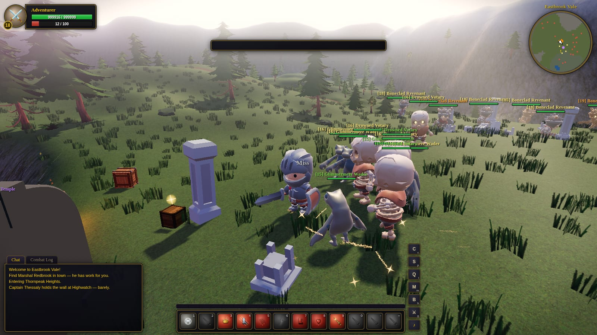
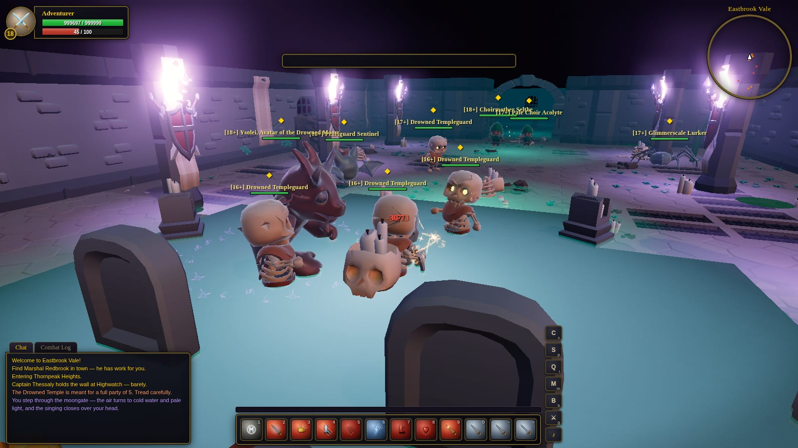

<div align="center">

# World of ClaudeCraft

**Wykonuj questy, twórz drużyny i raiduj ręcznie zbudowany świat, za darmo w przeglądarce. Open source, web3 i online już teraz.**

**Oficjalna strona: https://worldofclaudecraft.com/**

[](https://github.com/levy-street/world-of-claudecraft/actions/workflows/ci.yml)
[](https://www.typescriptlang.org/)
[](https://threejs.org/)
[](https://vite.dev/)
[](https://vitest.dev/)
[](https://www.postgresql.org/)
[](https://gymnasium.farama.org/)
[](../../LICENSE)
[](../../package.json)
[](CONTRIBUTING.pl_PL.md)
[](https://discord.gg/GjhnUsBtw)

[English](../../README.md) · [Español](README.es.md) · [Español (España)](README.es_ES.md) · [Français](README.fr_FR.md) · [Français (Canada)](README.fr_CA.md) · [Italiano](README.it_IT.md) · [Deutsch](README.de_DE.md) · [简体中文](README.zh_CN.md) · [繁體中文](README.zh_TW.md) · [한국어](README.ko_KR.md) · [日本語](README.ja_JP.md) · [Português (Brasil)](README.pt_BR.md) · [Русский](README.ru_RU.md) · [Nederlands](README.nl_NL.md) · **Polski** · [Bahasa Indonesia](README.id_ID.md) · [Türkçe](README.tr_TR.md) · [Svenska](README.sv_SE.md) · [Tiếng Việt](README.vi_VN.md) · [Dansk](README.da_DK.md)

[Zagraj teraz](https://worldofclaudecraft.com/) · [Postaw własny świat](#host-your-own-world-one-command) · [Wytrenuj agenta](#train-an-agent-headless-rl) · [Web3](#web3) · [Współtworzenie](CONTRIBUTING.pl_PL.md) · [Discord](https://discord.gg/GjhnUsBtw)


</div>

## Czym to jest

World of ClaudeCraft to kompletne MMO w stylu klasycznej ery, w które możesz zagrać już teraz w przeglądarce, postawić je samodzielnie jedną komendą, a nawet wytrenować agentów AI, by w nie grali. Jest darmowe, open source i dostępne na żywo pod adresem [worldofclaudecraft.com](https://worldofclaudecraft.com/).

Jeden wspólny świat działa w trzech miejscach, wszystkie z tego samego rdzenia gry:

- **świat offline w przeglądarce**, gdzie klikasz Play Offline i już jesteś w grze,
- **autorytatywny serwer wieloosobowy**, gdzie konta oparte na Postgres współdzielą żywy świat,
- **bezgłowe środowisko RL**, gdzie Python steruje prawdziwą grą przez interfejs Gym.

Ten sam seed, ten sam świat, wszędzie. I prawie nic nie jest dostarczonym zasobem: miasta, stworzenia, ikony zaklęć i dźwięk są generowane w czasie działania.

## Najważniejsze cechy

- **Dziewięć klasycznych klas**, każda z prawdziwym zestawem w stylu vanilla, który zyskuje rangi wraz z poziomami, plus pełny **system talentów** (trzy specjalizacje na klasę, 27 specjalizacji w sumie).
- **Trzy strefy otwartego świata** od poziomu 1 do 20, blisko 80 questów i jedna spójna fabuła o spisku Gravecaller.
- **Pięć instancjonowanych lochów**, cztery z nich to pięcioosobowe raidy elitarne, a jeden to samotna krypta, z elitarnym skalowaniem, mechanikami bossów AoE i lootem dopasowanym do archetypów klas.
- **Skalowalne delves**, tryb dla małej grupy jednego lub dwóch graczy plus towarzysz AI, odbudowywany z losowych komnat przy każdym wejściu, w poziomach Normal i Heroic.
- **The Ashen Coliseum**, rankingowa arena PvP z drabinkami 1v1 i 2v2 oraz trybem 2v2 Fiesta (zbieranie wzmocnień, kurczący się pierścień, pierwszy do piętnastu pokonanych).
- **Prawdziwy multiplayer**: drużyny, handel, pojedynki, prawa do lootu, dzielenie XP w drużynie, szepty, status nieobecności i serwer, który posiada każdy rzut walki.
- **Wszystko proceduralne**: miasta o konstrukcji szachulcowej, animowane rodziny stworzeń, malowane na canvasie ikony zaklęć, dźwięk WebAudio, pogoda biomów i cienie w czasie rzeczywistym. Brak plików modeli 3D dla świata.
- **Zlokalizowane do 21 języków** przez deterministyczny potok, w którym sim emituje klucze.
- **Bezgłowe środowisko RL** z powiązaniami Gymnasium, kształtowaniem nagrody i trybem benchmarku.
- **Natywne web3**: połącz portfel Solana, by pokazać swoje saldo $WOC i kosmetyczną odznakę posiadacza, w pełni opcjonalne i niepowiernicze.

## Zrzuty ekranu


| | |
|:---:|:---:|
| <br>*Zmierzch przy ognisku w Eastbrook* | <br>*Oświetlone pochodniami elitarne pulle w the Hollow Crypt* |
| <br>*Niespokojni umarli przy zrujnowanej kaplicy* | <br>*W przewadze liczebnej wroga w obozie bandytów* |
| <br>*Old Greyjaw, rzadki spawn, dopadnięty na północnej drodze* | <br>*Zaopatrywanie się u Smith Haldren, z podpowiedziami, torbami i monetami* |
| <br>*Utopieni wychodzą przy bramie księżycowej w Glimmermere* | <br>*Moonfire i ołtarz the Drowned Temple* |

Pogoda jest sterowana biomami i istnieje tylko w warstwie renderowania, więc nigdy nie dotyka deterministycznego sima:

| | | |
|:---:|:---:|:---:|
| <br>*Pogodnie nad Vale* | <br>*Deszcz nad Mirefen Marsh* | <br>*Śnieg na Thornpeak Heights* |

## Zagraj

Masz dwie drogi wejścia i obie uruchamiają ten sam świat.

### Offline, w przeglądarce

```bash
npm install
npm run dev        # then open http://localhost:5173 and click Play Offline
```

Nazwij swoją postać, wybierz jedną z dziewięciu klas i zaczynasz w **Eastbrook Vale** (poziomy 1-7), miasteczku targowym otoczonym sześcioma węzłami: ścieżki wilków na północy, łąki dzików na wschodzie, the Webwood na zachodzie, Mirror Lake na północnym zachodzie, koboldowy wykop miedzi na południowym zachodzie i zrujnowana kaplica niespokojnych umarłych na północnym wschodzie, z obozem bandytów Gorrak na południowym wschodzie. Północna droga wspina się przez przełęcz górską do **Mirefen Marsh** (6-13, węzeł Fenbridge), a dalej w górę do **Thornpeak Heights** (13-20, węzeł Highwatch). Seed świata jest ustalony w `src/main.ts`, więc to to samo miejsce przy każdej wizycie.

### Online, z innymi graczami

Zobacz [Postaw własny świat](#host-your-own-world-one-command) poniżej, by uruchomić prawdziwą grę klient/serwer z kontami i trwałymi postaciami.

<a id="host-your-own-world-one-command"></a>

## Postaw własny świat (jedną komendą)

```bash
cp .env.example .env
# edit .env and set a long random POSTGRES_PASSWORD
docker compose up -d --build     # postgres + game server, fully built
# open http://localhost:8787 for accounts, characters, and the whole world
```

Aby **hostować zdalnie**, umieść stos compose na dowolnym VPS, ustaw prawdziwe `POSTGRES_PASSWORD` w środowisku i wystaw port 8787 za odwrotnym proxy z TLS. W Caddy to dwie linijki (`your.domain { reverse_proxy localhost:8787 }`); WebSockety są proxowane automatycznie, a klient sam wybiera `wss://` na stronach https. Punkty końcowe uwierzytelniania mają limit zapytań na IP, hasła są haszowane przez scrypt, a tokeny wygasają po 7 dniach. Nigdy nie ustawiaj `ALLOW_DEV_COMMANDS=1` na produkcji, ponieważ włącza to cheaty na poziom i teleportację, których używają boty testowe. Zobacz [DEPLOY.md](../../DEPLOY.md) po pełny przewodnik produkcyjny.

<a id="develop-online-with-hot-reload"></a>

### Rozwijaj online z hot reload

```bash
npm install
cp .env.example .env
# set POSTGRES_PASSWORD and point DATABASE_URL at the same password
npm run db:up        # postgres 16 in docker (port 5433, volume-persisted)
npm run server       # authoritative game server on :8787 (REST + WebSocket)
npm run dev          # client dev server on :5173 (proxies /api and /ws)
```

Otwórz http://localhost:5173, wybierz **Play Online**, utwórz konto, utwórz postać i wejdź do świata (Enter World). Otwórz drugą kartę i zaloguj się ponownie, by zobaczyć się nawzajem w mieście. `Enter` otwiera czat. Prawdziwa wiki gracza oparta na MediaWiki uruchamia się obok stosu Docker Compose pod adresem http://localhost:8080/wiki/; jej strony startowe są generowane z aktualnej zawartości gry komendą `npm run wiki:seed`.

Co jest zachowywane i jak serwer pozostaje u steru:

- **Konta**: hasła haszowane przez scrypt i 7-dniowe tokeny bearer (`auth_tokens`).
- **Postacie**: do 10 na konto; poziom, ekwipunek, torby, questy, talenty, pozycja i pieniądze są zachowywane jako JSONB w Postgres, zapisywane co 30 sekund, przy wylogowaniu i przy wyłączeniu serwera. Imiona są globalnie unikalne, tylko litery, w klasycznym stylu.
- **Serwer jest autorytatywny**: klienci strumieniują intencję ruchu i komendy z częstotliwością 20 Hz; serwer uruchamia jeden wspólny `Sim` i zwraca migawki ograniczone zakresem zainteresowania (~120 yd) plus zdarzenia dla każdego gracza. Każdy rzut walki, drop lootu, zaliczenie questa i transakcja u sprzedawcy są rozstrzygane po stronie serwera. Klient jest renderem.

<a id="train-an-agent-headless-rl"></a>

## Wytrenuj agenta (bezgłowe RL)

Ten sam deterministyczny rdzeń działa jako środowisko [Gymnasium](https://gymnasium.farama.org/), więc agent uczy się na prawdziwej grze, a nie na jej reimplementacji. Serwer środowiska (`headless/env_server.ts`) opakowuje jeden `Sim` i mówi JSON-em rozdzielanym znakami nowej linii przez stdio; powiązania Pythona w `python/` uruchamiają go jako podproces i wystawiają zwykłą pętlę `reset` / `step` / `close`.

```bash
npm run build:env    # bundle the env server to dist-env/env_server.cjs
npm run env          # run it directly (NDJSON on stdio)
npm run bench        # in-process throughput benchmark (no IPC)

# drive it from Python
pip install gymnasium numpy
python python/example_random_agent.py
```

```python
from wow_env import WoWClassicEnv

env = WoWClassicEnv(player_class="warrior")   # warrior or mage
obs, info = env.reset(seed=42)
obs, reward, terminated, truncated, info = env.step(env.action_space.sample())
env.close()
```

- **Przestrzenie obserwacji i akcji wywodzą się z zawartości.** Odpytuj o nie z odpowiedzi `info` środowiska przy starcie, zamiast je zakodować na sztywno; rosną wraz z grą. Dziś przestrzeń akcji to `Discrete(44)` (ruch, cel, atak, pełny zestaw umiejętności, interakcja, jedzenie/picie), a obserwacja to `Box` 276 liczb zmiennoprzecinkowych (ja, umiejętności, cel, pobliskie moby, najbliższy obiekt interaktywny, postęp questów).
- **Nagroda** to ważona suma przyrostów liczników na tick (XP, zadane i otrzymane obrażenia, zabójstwa, śmierci, postęp questów, awanse), regulowana przy każdym resecie. Każdy `step` stosuje jedną akcję i domyślnie posuwa o pięć ticków sima, czyli mniej więcej cztery decyzje na symulowaną sekundę.
- **Deterministyczne z założenia.** Brak zegara ściennego, brak `Math.random`. Zaseeduj reset, a epizod odtworzy się dokładnie.

Protokół i powiązania są udokumentowane w `headless/CLAUDE.md` i `python/CLAUDE.md`.

<a id="web3"></a>

## Web3

World of ClaudeCraft jest natywnie web3 wokół **$WOC**, naszego społecznościowego tokena na Solana. Połącz portfel Solana, powiąż go z kontem jednym podpisem (niepowiernicze, brak transakcji do zatwierdzenia), a twoje tylko do odczytu saldo $WOC pojawi się w HUD obok kosmetycznej odznaki poziomu posiadacza.

Jest tylko kosmetyczne i niepotrzebne do gry. Nic nie jest wydawane ani zarabiane w grze, nie ma pay-to-win, a cała gra działa świetnie bez ani jednego połączenia portfela.

**Adres kontraktu $WOC (Solana):**

```
3WjLscH2JsXLEFJZRA9z8ti8yRGxWGKbqymPd7UicRth
```

Więcej o tokenie na [worldofclaudecraft.com](https://worldofclaudecraft.com/).

## Wycieczka po świecie

### Dziewięć klas

Każda klasa korzysta z prawdziwych mechanik w stylu vanilla i uczy się zaklęć z rangami w poziomach 1-20 (Lightning Bolt R2 na 8, R3 na 14, R4 na 20, a umiejętności z wysokich pasm jak Execute, Kidney Shot, Flash Heal, Stormstrike i Starfire przychodzą na swoim klasycznym poziomie).

- **Warrior**: rage, Heroic Strike (na następne uderzenie, poza GCD), Battle Shout, Charge, Rend, Thunder Clap, Hamstring, Bloodrage, Overpower (proc z uniku).
- **Paladin**: Seal of Righteousness uwalniane przez Judgement, Holy Light, Devotion Aura, Blessing of Might, Divine Protection (absorpcja), Hammer of Justice (ogłuszenie), Lay on Hands.
- **Hunter**: dystansowe Auto Shot (8-35 yd z klasyczną martwą strefą), Raptor Strike, Aspect of the Hawk, Serpent Sting, Arcane Shot, Concussive Shot, Mongoose Bite, Wing Clip oraz oswajalny zwierzak od poziomu 10.
- **Rogue**: energia i punkty combo, Sinister Strike, Eviscerate, Backstab (od tyłu, sztylet), Gouge, Evasion, Slice and Dice, Sprint.
- **Priest**: Smite, Lesser Heal, Power Word: Fortitude, Shadow Word: Pain, Power Word: Shield (absorpcja), Renew (HoT), Mind Blast.
- **Shaman**: Lightning Bolt, Rockbiter Weapon (nasączenie), Healing Wave, Earth Shock, Lightning Shield (kolce), Flame Shock.
- **Mage**: Fireball, Frost Armor, Arcane Intellect, Frostbolt, Conjure Water, Fire Blast, Arcane Missiles (kanałowane), Polymorph, Frost Nova.
- **Warlock**: Shadow Bolt, Demon Skin, Immolate, Corruption, Life Tap, Curse of Agony, Drain Life oraz siedem przyzywalnych demonów od Imp do Doomguard.
- **Druid**: Wrath, Healing Touch, Mark of the Wild, Moonfire, Rejuvenation, Thorns, Entangling Roots, Bear Form na 10.

Leczenie i wzmocnienia trafiają w członków drużyny, leczenie może trafić krytycznie, a tarcze absorpcyjne pochłaniają obrażenia przed zdrowiem. Wydawaj punkty w **trzech specjalizacjach talentów na klasę** (Arms/Fury/Protection, Balance/Feral/Restoration i tak dalej); alokacja jest walidowana po stronie serwera i eksportowalna jako ciąg buildu.

### Lochy

Fabuła Gravecaller przebiega przez cztery pięcioosobowe instancje elitarne, a samotna krypta stoi z boku dla odkrywców.

- **The Hollow Crypt** (5 graczy) pod the Fallen Chapel: sparowany elitarny trash, miniboss Sexton Marrow oraz Morthen the Gravecaller, który co dziesięć sekund rzuca Shadow Pulse AoE. Drzwi krypty teleportują twoją drużynę do prywatnej kopii instancji, która resetuje się po pięciu minutach pustki.
- **The Sunken Bastion** (5 graczy, około poziomu 13, południowo-wschodni Mirefen): Vael the Mistcaller przyzywa fale Drowned Thralls przy 60% i 30% zdrowia.
- **Gravewyrm Sanctum** (5 graczy, poziom 20, pod Thornpeak): trzy komnaty elitarnych kościanych strażników i drakonidów, Korgath the Bound (wpada w szał poniżej 30%), Grand Necromancer Velkhar oraz Korzul the Gravewyrm, gdzie wypada epicka broń.
- **The Drowned Temple** (5 graczy) przez bramę księżycową Glimmermere: blada, księżycowo-fioletowa instancja prowadząca do Choirmother Selthe, a potem Ysolei, Avatar of the Drowned Moon, która co dziewięć sekund pulsuje Lunar Tide i przyzywa Moonspawn przy 60% i 30%.
- **The Abandoned Crypt** (solo) w Thornpeak: cicha wyprawa z kluczem i pamiętnikiem dla jednego, której trop odpieczętowuje królewskie drzwi do **Nythraxis, Scourge of Thornpeak**, dziesięcioosobowego finału raidu rozgrywanego na trzech kamieniach strażniczych dusz.

Prowadzące do tego łańcuchy questów da się przejść solo, więc fabuła nigdy nie jest zablokowana za znalezieniem grupy. Nasz zautomatyzowany raid pięciu botów (warrior, paladin, priest, mage, hunter ze skupionym ostrzałem i AI uzdrowiciela) czyści the Hollow Crypt w jakieś pięć minut (`node scripts/crypt_raid.mjs`, wymaga `ALLOW_DEV_COMMANDS=1`).

### Delves

Delves to osobny, skalowalny tryb dla małej grupy jednego lub dwóch graczy. **The Collapsed Reliquary** (poziom 7 i wyżej) to krypta odbudowywana z losowych komnat przy każdym wejściu, kończąca się na Deacon Varric. Przejdź ją solo, a towarzysz AI, Tessa, walczy u twojego boku. Brother Halven przy ruinie relikwiarza prowadzi tablicę delves, gdzie Normal czy Heroic to twój wybór: Heroic podnosi poziomy wrogów i dodaje losowy afiks dla bogatszych nagród.

### The Ashen Coliseum (rankingowe PvP)

Naciśnij `G` lub przycisk areny, by dołączyć do kolejki. Dobieranie graczy teleportuje wojowników do prywatnej, oświetlonej pochodniami areny, krótkie odliczanie leczy i resetuje wszystkich dla uczciwego startu, a starcie kończy się, gdy strona poddaje się przy 1 hp. Nikt nie ginie, a wracasz dokładnie tam, gdzie dołączyłeś do kolejki.

- **Rankingowe drabinki 1v1 i 2v2**, każda z trwałym rankingiem w stylu Elo (każdy zaczyna od 1500) i wieczną tablicą wyników (`GET /api/arena/leaderboard`).
- **2v2 Fiesta**, żywszy tryb imprezowy: pierwsza drużyna do piętnastu pokonanych wygrywa w limicie sześciu minut, gracze odradzają się na rosnących licznikach, zbieranie wzmocnień rozdaje moc w trzech falach, a zamykający się pierścień zmusza do wspólnej walki.

### Gra razem

- **Drużyny** do 5: kliknij gracza prawym przyciskiem i Invite to Party. Członkowie dzielą prawa do lootu i zaliczenie questów, dzielą XP z prawdziwymi vanilla bonusami grupowymi (1.166 / 1.3 / 1.43 dla 3/4/5) i pojawiają się jako punkty na minimapie. `/p` na czat drużyny, `/roll` na rozstrzygnięcie lootu.
- **Handel**: kliknij prawym przyciskiem i Trade. Obie strony wystawiają przedmioty i pieniądze, obie muszą zaakceptować, a wymiana jest atomowa i walidowana po stronie serwera. Przedmiotów questowych nie da się wymieniać, a rozejście się anuluje transakcję.
- **Pojedynki**: kliknij prawym przyciskiem i Challenge to a Duel. 3-sekundowe odliczanie, potem walka do momentu, aż jedna strona trafi w 1 hp; zwycięzca jest ogłaszany na całą strefę, a odbiegnięcie na 60 jardów oznacza poddanie.
- **Prawa do lootu i status nieobecności**: pierwszy gracz, który zrani moba, posiada jego loot, XP i zaliczenie questa; `/afk` i `/dnd` oznaczają cię jako nieobecnego z automatyczną odpowiedzią na szepty.

### Świat i systemy

- **Jedzenie i picie**: usiądź, by regenerować przez 18 sekund, przerywane przez obrażenia lub wstanie, i tak, możesz jeść i pić naraz.
- **Sprzedawcy**, którzy kupują jedzenie i wodę oraz sprzedają uczciwy biały sprzęt, z monetami pokazanymi w złocie, srebrze i miedzi.
- **AI mobów**: wędrowanie, agresja na bliskość zależna od różnicy poziomów, pulle społeczne, pościg, smycz i reset, loot z trupa i respawny, z rzadkim spawnem (Old Greyjaw) na długim liczniku.
- **Łowiska** z własnymi tabelami lootu i rzadkimi połowami.
- **Kosmetyczne skiny** losowane w rzadkości uncommon, rare i epic, czysto dla wyglądu.
- **Śmierć i powrót**: uwolnij ducha do cmentarza, otrzymuj obrażenia od upadku i zwalniaj podczas pływania.
- **Pogoda biomów**: pogodnie w Vale, deszcz w Marsh, śnieg na Peaks, z płynnym przejściem, gdy przemieszczasz się między strefami.

### Sterowanie (klasyczny układ)

| Wejście | Akcja |
|---|---|
| `W` / `S` | bieg / cofanie. `A`/`D` skręt (strafe z wciśniętym prawym przyciskiem myszy), `Q`/`E` strafe |
| przeciąganie prawym / lewym | rozglądanie się / orbita kamery. Kółko przybliża, `Space` skacze |
| `Tab` | przełączanie najbliższych wrogów. Lewy przycisk wybiera cel, prawy atakuje, lootuje lub rozmawia |
| `1`-`9`, `0`, `-`, `=` | pasek akcji |
| `F` | interakcja (zlootuj trupa, podnieś obiekt, rozmawiaj) |
| `C` `P` `L` `M` `B` `G` | postać, księga zaklęć, dziennik questów, mapa świata, torby, arena |
| `V` / `R` / `Esc` | plakietki, autobieg, zamknij okna lub wyczyść cel |

Sterowanie dotykowe (gałka ruchu, przeciąganie kamery i przyciski akcji na ekranie) pojawia się automatycznie na urządzeniach mobilnych.

## Architektura (jeden sim, trzy hosty)

Projekt spinają trzy idee:

- **Jeden sim, trzy hosty.** Ten sam kod `src/sim/` uruchamia świat offline w przeglądarce, serwer online i środowisko RL. Zachowanie musi być wszędzie identyczne, a testy istnieją po to, by tak pozostało.
- **`IWorld` jest jedynym szwem.** `src/world_api.ts` definiuje `IWorld`. Offline'owy `Sim` spełnia go strukturalnie, a online'owy `ClientWorld` implementuje go, odzwierciedlając migawki serwera. Render i HUD rozmawiają tylko z `IWorld`, nigdy z konkretnym światem, więc nowa funkcja najpierw rozszerza interfejs, a potem oba światy.
- **Serwer jest autorytatywny.** Klienci wysyłają intencję; serwer decyduje o wynikach. Klient nigdy nie rozstrzyga sam walki, lootu ani ekonomii.

Sim to stały tick 20 Hz (`DT = 1/20`), cała losowość płynie przez jeden zaseedowany `Rng`, a `src/sim/` nie niesie żadnych importów DOM, przeglądarki ani Three.js. To właśnie pozwala temu samemu kodowi zbundlować się w serwer środowiska Node, autorytatywną pętlę gry i kartę przeglądarki bez zmiany ani jednej linii.

### Układ projektu

| Ścieżka | Co to jest |
|---|---|
| `src/sim/` | Deterministyczny rdzeń gry, źródło prawdy. Brak zależności DOM ani Three. |
| `src/sim/content/` | Dane jako kod: dziewięć klas, umiejętności, strefy, lochy, przedmioty, talenty. |
| `src/render/` | Render Three.js (proceduralna geometria, tekstury, VFX). Czyta świat, nigdy go nie mutuje. |
| `src/game/` | Lokalne wejście, kamera, klawiszologia, sterowanie mobilne, proceduralne WebAudio. |
| `src/ui/` | Klasyczny HUD (ramki, okna, podpowiedzi, mapa, pływający tekst walki), proceduralne ikony, i18n. |
| `src/net/` | Klient online: uwierzytelnianie REST plus lustro świata WebSocket (`ClientWorld`). |
| `src/admin/` | SPA panelu administratora (osobne wejście `admin.html`). |
| `server/` | Autorytatywny serwer: HTTP i WS, pętla świata, Postgres, uwierzytelnianie, funkcje społeczne, moderacja. |
| `headless/` + `python/` | Serwer środowiska RL (`env_server.ts`) i powiązania Python Gym. |
| `tests/` | Zestaw Vitest. |
| `scripts/` | Budowanie zasobów plus skrypty przeglądarkowe E2E, zrzutów ekranu i integracyjne. |
| `public/` · `docs/` | Statyczne zasoby (modele GLB, tekstury, HDRI) i dokumenty projektowe. |

Większość katalogów niesie własny `CLAUDE.md` z lokalnymi konwencjami. Pełen zestaw niezmienników projektu mieszka w głównym [`CLAUDE.md`](../../CLAUDE.md).

## Zbudowane jak klasyki

Walka, zdobywanie poziomów i zagrożenie działają na autentycznych zasadach klasycznej ery: rage i energia, tabele trafień i uników, redukcja obrażeń przez pancerz, prawdziwa krzywa XP, liczniki uderzeń i globalny cooldown. Czuje się tak, jak pamiętasz, a nie jest jedynie przybliżeniem. Dokładne liczby mieszkają w `src/sim/`, jeśli chcesz je przeczytać.

I prawie nic z tego nie jest dostarczonym zasobem. Świat jest rysowany z kodu:

- Proceduralne miasta, stworzenia, teren, woda, pogoda i cienie w czasie rzeczywistym, bez plików modeli 3D dla świata.
- Dwanaście animowanych rodzin stworzeń z pełnymi animacjami chodu, ataku, rzucania, siedzenia i śmierci.
- Ikony zaklęć, przedmiotów i wzmocnień malowane na canvasie w czasie działania.
- Kompletny klasyczny HUD (ramki jednostek, paski akcji, podpowiedzi, dziennik questów, mapa świata, minimapa, pływający tekst walki) i proceduralne WebAudio dla każdego dźwięku.

## Rozwój

```bash
npm test                        # vitest: formulas, combat, AI, quests, all 9 classes, parties, duels, trades, dungeons
npm run build                   # production web build
node scripts/smoke_browser.mjs  # warrior end-to-end (needs npm run dev)
node scripts/smoke_mage.mjs     # mage: casting, polymorph, conjure and drink, death and release
node scripts/visual_tour.mjs    # screenshot tour of the zone and UI into tmp/
node scripts/tour_temple.mjs    # screenshot tour of the Glimmermere and Drowned Temple into tmp/
node scripts/mp_integration.mjs # API, WS, and persistence checks (server running)
node scripts/social_e2e.mjs     # trade and duel over the wire (ALLOW_DEV_COMMANDS=1)
node scripts/arena_visual.mjs   # two clients queue and fight a ranked 1v1
node scripts/crypt_raid.mjs     # five bots clear the Hollow Crypt (ALLOW_DEV_COMMANDS=1)
```

Testy logiki i jednostkowe używają Vitest. Podczas iteracji uruchom pojedynczy plik: `npx vitest run tests/sim.test.ts`. Skrypty E2E i wizualne sterują prawdziwymi przeglądarkami przez `puppeteer-core` i wymagają działającego `npm run dev` (często też `npm run server`). Agenci przeglądarkowi mogą sterować ruchem przez `window.__game.controller` zamiast symulować wciśnięte klawisze, na przykład `controller.move({ forward: true }, facingRadians)` lub kompaktowe flagi jak `{ f: 1, sr: 1 }`.

Komendy serwera znajdziesz w [Rozwijaj online](#develop-online-with-hot-reload) powyżej, [DEPLOY.md](../../DEPLOY.md) dla produkcji oraz [CREDITS.md](../../CREDITS.md) dla licencji zasobów.

## Lokalizacja

Każdy widoczny dla gracza ciąg jest rozstrzygany przez `t()`, a gra jest dostarczana w **21 językach** (angielski, dwa hiszpańskie, dwa francuskie, angielski kanadyjski, włoski, niemiecki, chiński uproszczony i tradycyjny, koreański, japoński, brazylijski portugalski, rosyjski, niderlandzki, polski, indonezyjski, turecki, szwedzki, wietnamski i duński). Sim i serwer pozostają niezależne od języka: emitują stabilne klucze lub angielski, który klient ponownie lokalizuje na granicy, co utrzymuje determinizm nienaruszony. Współtwórcy dodają tylko angielski; opiekun wsadowo wypełnia pozostałe języki przed każdym wydaniem. Proces jest udokumentowany w `docs/i18n-scaling/translation-workflow.md`.

## Współtworzenie

Mile widziane są wszelkiego rodzaju wkłady: kod, tłumaczenia, zgłoszenia błędów i dokumentacja. Zacznij od [CONTRIBUTING.pl_PL.md](CONTRIBUTING.pl_PL.md) po konfigurację, przeczytaj [Kodeks postępowania](../../CODE_OF_CONDUCT.md) i sprawdź [SECURITY.md](../../SECURITY.md) przed zgłoszeniem podatności. Nowy tutaj? Poszukaj zgłoszeń oznaczonych [`good first issue`](https://github.com/levy-street/world-of-claudecraft/labels/good%20first%20issue), otwórz [zgłoszenie](https://github.com/levy-street/world-of-claudecraft/issues/new/choose) lub przywitaj się na [Discordzie](https://discord.gg/GjhnUsBtw).

<div align="center">


</div>

## Licencja

Kod jest [na licencji MIT](../../LICENSE), więc forkuj go, remiksuj i postaw własny świat.

Dołączone zasoby graficzne stron trzecich (modele, tekstury, HDRI) zachowują własne licencje, wszystkie CC0 domena publiczna z wyjątkiem map normalnych wody na licencji MIT, udokumentowane per paczka w [CREDITS.md](../../CREDITS.md).
